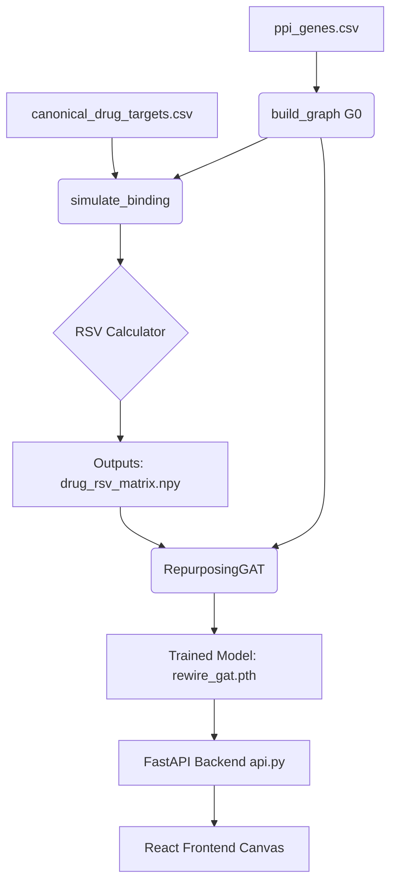

<div align="center">
  <h1>🧬 REWIRE</h1>
  <p><strong>A Graph Attention Network (GAT) pipeline for cross-disease drug repurposing using accelerated Network Target (RSV) computations.</strong></p>

  [](https://python.org)
  [](https://fastapi.tiangolo.com/)
  [](https://pytorch.org/)
  [](https://reactjs.org/)
  [](https://vitejs.dev/)
</div>

---

## 💡 Overview

**REWIRE** overcomes the computational bottlenecks of large-scale graph metric recalculation during sequential drug perturbation simulations. By precomputing static baselines and parallelizing local perturbations, REWIRE rapidly computes a 4-dimensional **Rewiring Sensitivity Vector (RSV)** for each drug.

This vector is fused with a **Graph Attention Network (GAT)** embedding, rendering continuously differentiated drug representations to solve the "identical-rankings" bug and enabling precision drug repurposing across 8 distinct disease clusters.

## 🏗️ Architecture



## 🛠️ Tech Stack

### Backend Engine
- **Framework**: FastAPI (Uvicorn)
- **Machine Learning**: PyTorch, PyTorch Geometric
- **Graph Processing**: NetworkX, python-louvain
- **Data Engineering**: Pandas, NumPy, SciPy

### Frontend Application
- **Framework**: React 19 (Vite)
- **Styling**: Tailwind CSS
- **Visualizations**: react-force-graph-2d, Framer Motion

---

## 🚀 Getting Started

### Prerequisites
Make sure you have [Python 3.10+](https://www.python.org/) and [Node.js 18+](https://nodejs.org/) installed.

### 1. Clone the repository
```bash
git clone https://github.com/akhileshchandaluri/BIO-REWIRE.git
cd BIO-REWIRE
```

### 2. Backend Setup
Install the Python dependencies and run the FastAPI server:

```bash
# Install required Python packages
pip install -r requirements.txt

# Start the backend server
python api.py
```
*The backend will be running at `http://127.0.0.1:8000`*

### 3. Frontend Setup
In a new terminal window, initialize and run the React frontend:

```bash
# Navigate to the frontend directory
cd frontend

# Install Node modules
npm install

# Start the Vite development server
npm run dev
```
*The frontend will typically be accessible at `http://localhost:5173`*

---

## 📡 API Endpoints

The FastAPI backend exposes the following core endpoints:

| Method | Endpoint | Description |
|--------|----------|-------------|
| `GET` | `/` | Health check & endpoint listing |
| `GET` | `/stats` | Returns global network metrics (proteins, edges, drugs) |
| `GET` | `/diseases` | Emits the array of trained disease clusters |
| `POST`| `/rank` | Accepts `{"disease_name": "...", "top_k": 10}` and returns ranked similarity scores |
| `GET` | `/drug/{name}/graph` | Returns induced subgraph (nodes & links) for graph visualization |

---

<div align="center">
  <p>Built for Precision Drug Repurposing 🧬</p>
</div>
